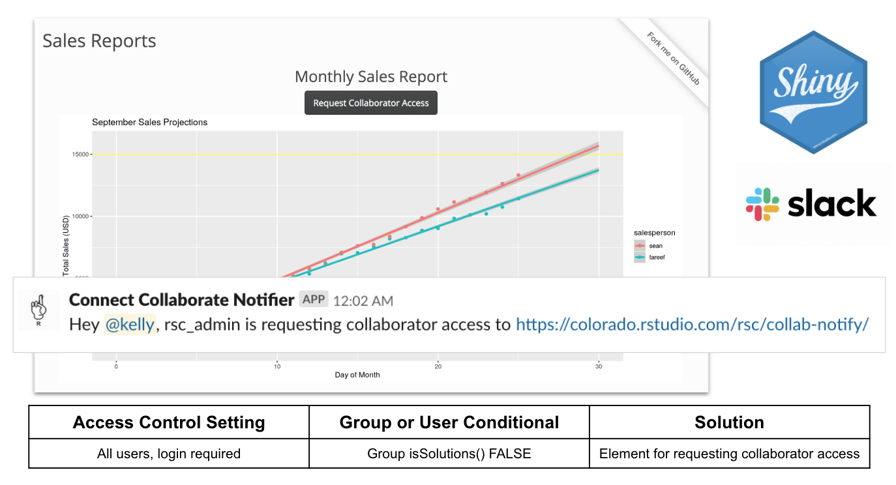
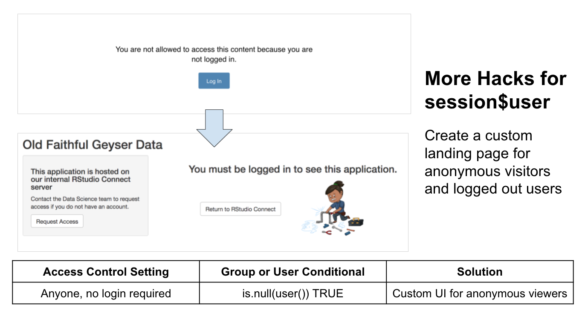

# Feature Toggle Experiments - Shiny 

Feature Toggle: A mechanism to selectively enable and disable features, or control which features are visible to specific user segments.

Inspiration: User privileges and personalized data access application by [Jeff Allen](https://twitter.com/TrestleJeff) - [Shiny Gallery example](https://shiny.rstudio.com/gallery/personalized-ui.html) and [reference article](https://shiny.rstudio.com/articles/permissions.html)

- Shiny applications can access the username and groups of the current user through the session parameter of the shinyServer function.
- Your application could use this information to display customized messages or to enable functionality for a specific subset of users.
- Create Dynamic UI elements: The `conditionalPanel` function, is used in ui.R and wraps a set of UI elements that need to be dynamically shown/hidden.

Presentation: https://speakerdeck.com/kellobri/art-of-the-feature-toggle

## Mixing Access Controls & Feature Toggles on RStudio Connect 

### Application: `Notify-Me`

- Problem: How can someone request collaborator access to my Shiny content on RStudio Connect?
- Solution: 
  - Feature toggle: expose an action button to users who aren't part of my collaboration group
  - Action button: trigger a Slack App (Incoming Webhook) to send me a notification

_Watch a demo of this solution on [YouTube](https://youtu.be/SDk9Suaj0kc)_

### Application: `Custom-Visitor-UI`

- Problem: How can I expose a custom landing page to anonymous visitors and users who have been logged out of the server?
- Solution:
  - Feature toggle: expose a simplified (redacted) version of the UI
  - Provide instructions or action buttons for visitors who want to request user accounts

_Watch a demo of this solution on [YouTube](https://youtu.be/YcmOsPLvTMA)_

## Connect with RStudio Solutions Engineering

- [RStudio Solutions Website & Blog](https://solutions.rstudio.com/)
- [RStudio R Admins Community](https://community.rstudio.com/c/r-admin)
